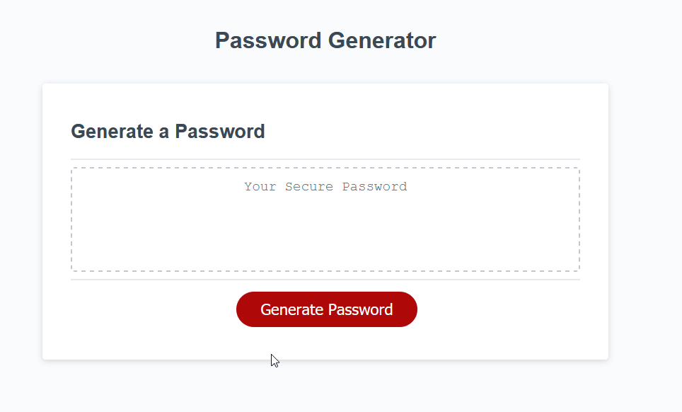

### Random Password Generator
---
**overview**

As more and more users create online accounts , it is very important to provide strong password for account protection. This simple web application uses a series of conditions which the users can choose to create a secure passwordwithout having to come up with one by themself.

can be used to generate secure password.
___ 

**Using The App**
1. Click on Generate Password button
2. Enter the length of password to generate. Minimum length required is 8.
3. Choose from multiple options (upper,lower or special character)
4. At the end the password is displayed on the blank space.
5. See the attached Gif for detailed preview
___

**Tools Used**
HTML | CSS | Javascript
